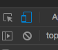

# PWA Notes

A simple example application, demonstrating how to turn a web application into a PWA

## What is a PWA?

[According to the team at Google](https://developers.google.com/web/progressive-web-apps/), a progressive web app (PWA) is a web application that takes advantage of some of the latest browser features in order to make an app that is **reliable**, **fast**, and **engaging**. 

  - **Reliable** - the app can and does load instantly, regardless of the user's connection
  - **Fast** - once the site is loaded, users expect it to be fast; this means smooth animations and "no janky scrolling [sic]"
  - **Engaging** - the app is installable on the user's home screen and offers a full screen experience when launched. Users can also be re-engaged with push notifications 

## But why?

The world is moving toward the web, for better or worse. To keep up with this shift, companies have been creating web applications, as opposed to native applications. <!-- need to come up with some examples --> PWAs make this possible. With the inclusion of a web manifest, some of the normal features you would expect from a native mobile app are possible in a PWA*. Your app can go fullscreen, it will for the most part, work offline, and you can even send your users push notifications. You also have access to a multitude of sensors and features that the device comes equipped with. 

Having a native, or native-like, application can increase your adoption rate. Google gives an example of [AliExpress](https://developers.google.com/web/showcase/2016/aliexpress), who saw

- 104% conversion rate across all browsers; 82% on iOS
- 2x more page visits 
- 74% increase in the amount of time spent on the site

These are pretty significant numbers in terms of conversion rates, and all of this was done with the help of PWAs.

> ### * Caveats
> 
> With the introduction of iOS 11.3, PWAs are supported on iPhones. However, the `manifest.json` implementation is still a little buggy, and there are still some features that don't currently work (i.e. Push Notifications, Background Sync). A lot of these issues, however, can be solved by using the [apple related link and meta tags](https://developer.apple.com/library/archive/documentation/AppleApplications/Reference/SafariWebContent/ConfiguringWebApplications/ConfiguringWebApplications.html) in your HTML file. Luckily, some of these features will be coming in future iOS updates. In general, however, PWAs will still work on iPhones and iPads.
> 
> As well, PWAs are not mobile applications. There is access to device features that are not available to PWAs. Here's a great list of features you have access to right now in your current browser: [What Can Web Do Today?](https://whatwebcando.today/) As time passes, this list will get better and better. 

## This is cool and all, but how?

*For these examples, we will be using [React](https://reactjs.org) where applicable.*

Hopefully you have a web application already. If you don't, make one. 

Step one is to make sure that your application looks good on mobile. In Chrome, you can open the developer console and fiddle with the screen dimensions of your browser window.



This will also change the user agent of the browser, so you will see how the app behaves on different platforms. If it looks good, you should be fine. If not, get to making some [media queries](https://developer.mozilla.org/en-US/docs/Web/CSS/Media_Queries/Using_media_queries) and making your application look good on mobile. Using a mobile first methodology to your designs helps with this process immensely. Most CSS frameworks nowadays work from this standpoint.

The next step is to make sure that your navigation still works in a headless browser. In `standalone` mode, your user won't have access to the normal toolbar bar. This means no URL input, no back buttons, and no refresh. What this means, is we need to give alternatives for navigating the app. Here are a few options:

- The Back Button™ - This is common in most apps on both iOS and Android
- Swipe navigation - This is also very common on most platforms. Swipe left, go forward; swipe right, go back.
- Menu navigation - Allows easy switching between different screens or views

Here's some examples of how I'm handling navigation in this app. Note: I use [`rmwc`](https://jamesmfriedman.github.io/rmwc/), a react binding of Google's Material Web Components.

### The Back Button™

This is fairly straightforward thing to implement. The key is to ensure that the front page your app doesn't have a back button.

```javascript
  ...
  import { 
    TopAppBar, 
    TopAppBarRow, 
    TopAppBarSection,
    TopAppBarFixedAdjust, 
    TopAppBarNavigationIcon 
  } from 'rmwc/TopAppBar';
  ...

  class Toolbar extends React.Component {
    
    ...
    needsBackButton = () => this.props.location.pathname !== '/';
    ...

    render() {
      return(
        <React.Fragment>
          <TopAppBar>
            <TopAppBarRow>
              <TopAppBarSection alignStart>
                {
                  this.needsBackButton()
                  ? <TopAppBarNavigationIcon 
                      use="arrow_back"
                      onClick={() => this.props.history.go(-1)}
                    />
                  : <BackPlaceholder/> // this can be a styled component to take the place of the back button when you don't need it
                }
              </TopAppBarSection>
              ...
            </TopAppBarRow>
          </TopAppBar>
          <TopAppBarFixedAdjust/>
        </React.Fragment>
      )
    }

  }

```

### Swipe Navigation

This uses the [`react-swipeable`](https://www.npmjs.com/package/react-swipeable) library. 

```javascript
  ...
  import Swipeable from 'react-swipeable';
  ...

  class SwipeableComponent extends React.Component {

    ...
    handleSwipedLeft = (evt, deltaX, isFlick) => {
      this.props.history.go(1);
    }

    handleSwipedRight = (evt, deltaX, isFlick) => {
      // this will prevent a right swipe from taking you out of the app
      if (this.props.location.url !== '/') {
        this.props.history.go(-1);
      }
    }
    ...

    render() {
      return (
        <Swipeable
          onSwipedLeft={this.handleSwipedLeft}
          onSwipedRight={this.handleSwipedRight}
        >
          ...
        </Swipeable>
      )
    }

  }

```

### Menu Navigation

For menu navigation, this should include the major relevant views, without overwhelming the user. If there are more than a few options, a hamburger menu might be more suited to your needs.

```javascript
  ...
  import { 
    TopAppBar, 
    TopAppBarRow, 
    TopAppBarSection,
    TopAppBarActionItem,
    TopAppBarFixedAdjust,
    TopAppBarNavigationIcon 
  } from 'rmwc/TopAppBar';
  import {
    Menu,
    MenuItem,
    MenuAnchor,
  } from 'rmwc/Menu';
  import { Link } from 'react-router-dom';
  ...

  class Toolbar extends React.Component {
    state = {
      menuOpen: false
    }

    toggleMenu = () => {
      this.setState(prev => ({
        menuOpen: !prev.menuOpen
      }));
    }

    render() {
      return (
        <React.Fragment>
          <TopAppBar>
            <TopAppBarRow>
              ...
              <TopAppBarSection alignEnd>
                <MenuAnchor>
                  <Menu
                    open={this.state.menuOpen}
                    onClose={this.toggleMenu}
                  >
                    <Link to="/#"><MenuItem>Home</MenuItem></Link>
                    <Link to="/#"><MenuItem>Trash</MenuItem></Link>
                  </Menu>

                  <TopAppBarActionItem
                    use="more_vert"
                    onClick={this.toggleMenu}
                  />
                </MenuAnchor>
              </TopAppBarSection>
              ...
            </TopAppBarRow>
          </TopAppBar>
          <TopAppBarFixedAdjust/>
        </React.Fragment>
      )
    }
  }
```
